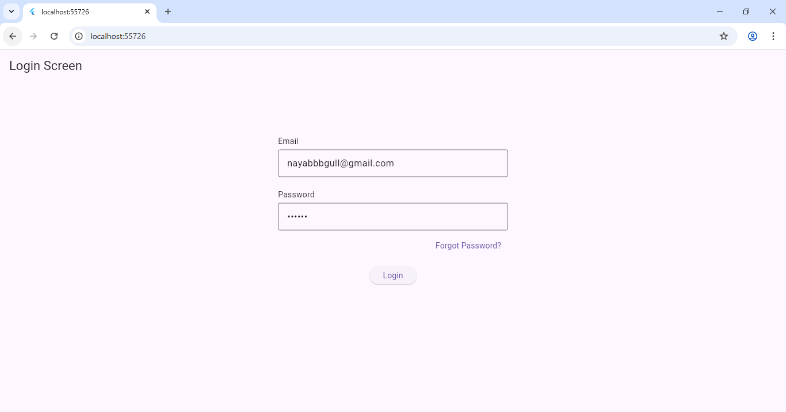
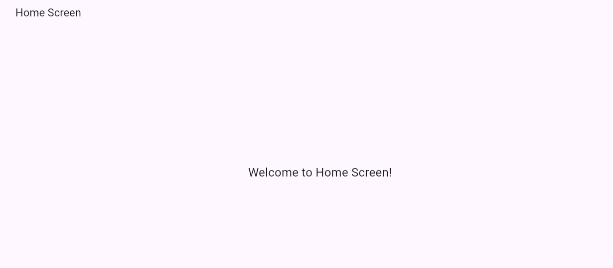

**Flutter Login UI App**

A clean and modern Flutter-based Login Screen UI built as part of Week 1 Internship Task.
This project focuses on UI development, widget structuring, and creating a responsive login layout using Flutter.

**Overview:**
This project contains a simple and elegant Login Interface that includes:
1.Email TextField
2.Password TextField
3.Login Button
It demonstrates basic UI components in Flutter such as Column, TextField, ElevatedButton, padding, alignment, and styling.

**Objectives (Internship Week-1):**
1.Understanding Flutter UI structure
2.Creating clean and reusable widgets
3.Practicing layout design
4.Uploading work to GitHub

**Features:**
1.Clean & Modern Flutter UI
2.Email and Password input fields
3.Secure Password Visibility Toggle 
4.Fully Responsive Layout
5.Beginner-friendly code structure

**Technologies Used:**
1.Flutter
2.Dart
3.Android Studio / VS Code
4.Material Design Widgets

**Project Structure:**
/lib
 ├── main.dart        → App entry file
/assets
/README.md
/pubspec.yaml

**How to Run:**
1. Clone the repository:
   git clone https://github.com/YourUserName/YourRepoName.git
2. Open folder in VS Code or Android Studio.
3. Run Flutter pub:
   flutter pub get
4. Launch the app:
   flutter run

**Screenshots**

**Login UI:**

**Home Page UI:**

**Sample UI (Short Description):**
The login UI includes:
1.Centered logo/title
2.Two text fields with hints
3.Password obscuring
4.Login button with styling
5.Proper padding and spacing

**Contributing:**
This is a learning-based project.
Suggestions or improvements are always welcome!

📩 Contact

Nayab Gull
Flutter Developer (Intern)

LinkedIn: https://www.linkedin.com/in/nayab-gull-4a4795293?utm_source=share&utm_campaign=share_via&utm_content=profile&utm_medium=android_app
Email: nayabbbgull@gmail.com

⭐ If you like this project, consider giving it a star!
